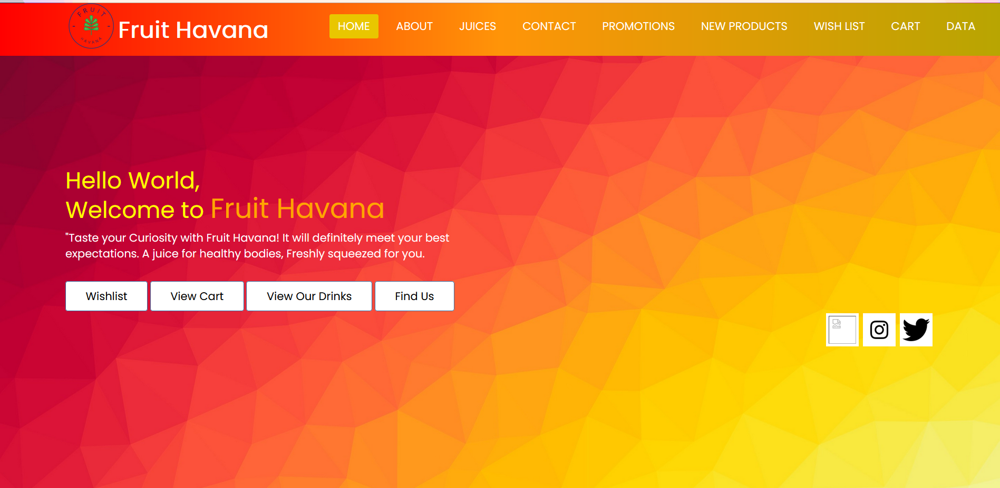
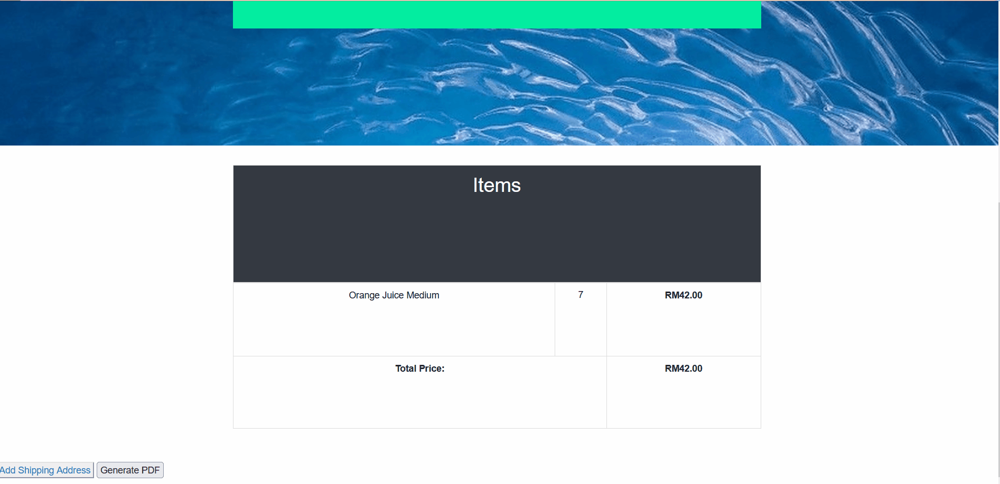

# Chinese_Alibaba_Shop
Y2S1 Web Design Project\
Task: Design an ecommerce website using HTML, CSS and Javascript

## Group Members
1. Tan Xi En (Leader)
2. Felix Len Wen Jun
3. Yeoh Siow Poo
4. Yew Jei Wey

## Learning Objective
1. Familiarize myself with building web pages using HTML and CSS
2. Familiarize myself with using bootstrap to create HTML pages
3. Learn to use Javascript to handle daily operations of website
4. Learn to use API and AJAX

## IDE Used
Visual Studio Code

## Libraries Used
Bootstrap version 4.6, JQuery

## Website Function
1. This website allows user to navigate through products
2. This website allows user to add products to wish list
3. This website allows user to add products to shopping cart to checkout
4. This website allows user to check the current weather conditions using weather API
5. This website allows user to check the store location using Map API
6. This website can be downloaded as a PWA
7. This website can receive push notifications from the store owner\
... And Many More

## Demonstration
1. Homepage
   
2. Product Page
   
   
   
   
3. Wishlist
   
4. Shopping Cart
   
5. Checkout
   

*Note: This website does not have any side server functionalities. This entire website does not use any SQL database or NoSQL Database like MongoDB or Google Firebase. This website is made entirely using Javascript and the product items are stored in a JSON File.*
